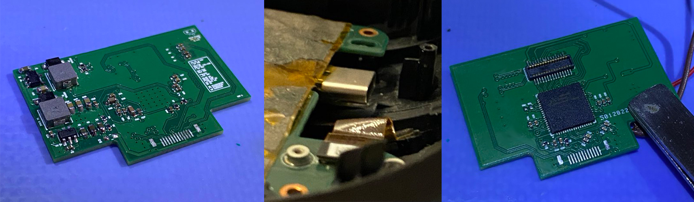

# USB-C mod for Windows Mixed Reality [WIP]
This project focuses on replacing the proprietary VR cable in Mixed Reality headsets with a single USB-C plug.

If you're here you probably know that the proprietary cables used in these headsets are prone to failure and unavailable for purchase as a separate part.
Due to damaged cables, dozens of Mixed Reality headsets end up in the trash. I want to change that.

# Development log

### March 2025

So there was a bit of a delay and currently I'm at revision E ... and I finally got the USB 3.0 working 🎉
 Now I get a display cable error, but that's some progress.

The main issue with the USB 3.0 was that I had to swap RX/TX pairs on my end because of the unusual PORT <--> PORT configuration without a proper switch.
Can't believe I missed something that simple, anyway that's just how it goes sometimes.

Current objectives are:
- Why HDMI doesn't work?
- Figure out how/where to put screw holes onto the PCB so that it can be properly mounted

---

### November 2024

PCB is now a 6 layer design per recommendations from Reddit where I asked around for help. Sadly, those changes didn't improve the situation.
However, switching to a 6-layer board allowed me to make the HDMI routing better so that's fewer issues going forward.

Now I have to focus on that USB 3.0 connection that just doesn't want to work.
Design-wise everything seems to be fine (I think) so I'm very confused.

I'll try to reduce clutter around the RX/TX traces and hide USB 2.0 inside the board which is way harder to break than USB 3.0.
See you in December!

---

### September 2024 - Second Update

New boards arrived yesterday, sadly they don't work!

New design behaves the same as the old one.
I haven't done much troubleshooting yet, but I think the high-speed signals are still getting destroyed when going through my PCB.

After changing the port I can fit a slim USB-C cable inside the headset after some slight modifications to the chassis - soo that part of the design worked out.

Headset behaviour as it stands right now is as below:
- Headset fails to initialize a USB 3.0 connection and switches to USB 2.0 speed instead
- A monitor appears with a resolution of 640x480@60Hz that identifies itself as a "Generic Monitor"
- Mixed Reality Portal opens up and shows an error that the USB port doesn't support USB 3.0

I've tried multiple cables and confirmed it's a problem with the PCB itself.
If you're someone who's experienced with high-speed PCB design, please take a look at [KiCad 8 project in the repo](https://github.com/rara64/windows-mixed-reality-usb-c/blob/main/pcb/usb-c-rev-b.zip).

---

### September 2024

So some time passed since the last update and I have a lot of stuff to discuss, but I'll keep it short.

PCBs arrived, I assembled one of them, and here's what I found:
- Currently, there's no space to fit a USB-C plug inside the headset so I had to do testing entirely outside the plastic chassis
- I failed the high-speed design on this one, none of the USB 3.0 lines worked and I had to solder an external cable to make it work for testing
- When I bypassed everything to make the USB 3.0 connection work I was stuck on display error as there was just too much interference for the CS5266 IC to do its job
- USB-C plug works only one way and is not reversible and thus triggers port protection when plugged the other way around since we don't have a switch (CS5266 is designed for a plug device, not a device with a USB-C port)
- Text is too small on the silkscreen and it is completely unreadable

I have already designed a new version, and it is on the way!

Fixes include:
- Thinner PCB (1mm vs 1.6mm) and a new layer stackup so I can better control the impedance of the signals
- Changed USB-C port to gain enough space for some plugs to fit inside (some modifications to the headset might be needed though!)
- Complete redesign of the CS5266 section to focus on signal integrity and impedance control as well as length matching
- Better labeling on the silkscreen

Hopefully, these changes will push us closer to the working thing.
New PCBs should arrive at the end of the next week.

---

### July 2024

I'm still working on that PCB design and I'm close to getting the design fabricated. Here's a little snippet of what's coming ahead!

I expect the first testing with a headset to happen around late August, at least I hope so 🤞

---

### May 2024

I chose to go with CS5266AN since it massively simplifies this project.
We just don't have enough space for a PD Controller + DP->HDMI Converter + TUSB-like chip.

The elephant in the room is obviously the lack of 90Hz support with this approach.
I know it might be a deal-breaker for some people as the acceptable/preferred refresh rate will differ from person to person.
On the other hand, I played my fair bit on 60Hz and it wasn't as bad as I would have thought.
That said, I would choose 90 over 60 anytime, but if that's the price of a working headset, I'm willing to take it.

I'll attempt to force 90Hz to see if it works once I assemble the first working PCB.
I just don't think we have enough bandwidth for that with a HDMI 1.4b link.

Five CS5266AN chips are already on the way and should arrive soon.
As of now, I also have a schematic ready for my PCB in KiCad, and most of the components selected.

Once the chips arrive, I'm going to make a test PCB at home to test the behavior of the chip regarding VBUS control and PD negotiation, because I have some blanks in my design in this regard.
The only documentation I found is a datasheet with vague information and a reference schematic for a 3-in-1 adapter like the one I bought in March but using this chip.
I guess that's another downside of going with a chip like this, but I'll definitely work it out.

Up next, track routing and PCB design!

---

### April 2024

I came to the conclusion that I have two options regarding the IC selection:
- **Go with reputable well-known brands that provide a lot of information and support for their products**

  I would need a TUSB564 or TUSB1064 as well as a PD controller to negotiate DP Alt Mode (or some other IC) and a chip to convert DP to HDMI 2.0.
  
- **Go with unknown brands and find a highly integrated chip thus reducing the complexity of the design**

  Chip with HDMI 2.0 converter built-in and DP Alt Mode negotiation would be ideal.

While the "unknown brands" path is tempting, it's really hard to find chips! I stumbled upon a **CS5266 from ASL Technology**, which seems to be ticking all the boxes.
The issue is that the integrated DP to HDMI conversion only supports 4K@30Hz which isn't in spec with HDMI 2.0 that we need.

UPDATE:
HDMI 2.0 claim is indeed a mistake, a newer revision of the datasheet shows the chip only supports HDMI 1.4b.

The issue with the multi-chip solution is that we don't have that much space inside the headset and I worry that it might be hard to properly route and fit the ICs on my PCB.
I will also look into that over the coming weeks to determine the best IC combination for this.

---

### March 2024

After looking at many options for such an IC, I ended up only with a few that are cheap and widely available.
However, due to USB-C HDMI Alt Mode being dead, I could only find ICs that feature DisplayPort Alt Mode.

Then I remembered that Aliexpress is filled with cheap multiport adapters that convert USB-C to HDMI/USB3.0, so I bought one!

| Top of the PCB | Bottom of the PCB |
| --- | --- |
|  |  |

At first glance, the design seems simple and all of the traces are visible so it will be relatively easy to reverse-engineer.
The issue is that the IC that the design is based on is not easily available for purchase - it's a GSV1201S made by GSCoolink (?).

Another caveat is that while the adapter was advertised as being HDMI 2.0, it's actually HDMI 1.4 - so it wouldn't be able to handle the headset at a 90Hz refresh rate.
While I could use it for my project and "sacrifice" Aliexpress adapters to fix Mixed Reality headsets I'm not quite sure about this idea.
For all I know, there could be other designs for the same-looking adapter! **So the hunt for the proper IC for this continues...**

---

### February 2024 - Project Reboot

I recently became more interested in trying VR again, so I went back to the drawing board and came up with an idea to make a USB-C mod for these headsets.
USB-C is just the way. 

The only downside I can think of at this point is that you will need a PC that features a USB-C port with DP ALT mode.
You can also buy a PCI-Express expansion card with USB-C DP Alt mode like I plan to do later down the line.

Up next, I need to find an IC that will make it possible to transfer HDMI 2.0 and USB 3.0 over USB-C and design a new PCB around it.

---

### Late 2022

I bought my Medion ERAZER X1000 Mixed Reality headset in 2022 for about 12$ excluding shipping as spares or repair. It was in a terrible condition, missing both the front and back foams.
Later I found out that the headset would work if the cable was bent a certain way, but I couldn't pinpoint where the cable broke. So I confirmed that the headset was working but had a broken cable as all the other ones.

Thankfully, while the cable is not easily replaceable by the user from the outside it can be unplugged after disassembling the headset. It sits in a connector on the headset's mainboard and is screwed with two screws from the sides.

The first solution I came up with was to make a board that would replace the OEM cable with pads to solder the HDMI and USB cables to - and this was a terrible idea, but a fun project nonetheless.
I needed to reverse-engineer the original cable first, so I cut through the ends of the original cable to figure out the pinout for the connector on the headset's motherboard. This was a long process by itself, but below is the final pinout I ended up with.

So now that I had the pinout, I could start designing the PCB for the breakout board. Before that, I needed to know the part number for the plug-end of the connector.
It turns out it's a [MOLEX 555600307 connector](https://www.lcsc.com/product-detail/Mezzanine-Connectors-Board-to-Board_MOLEX-555600307_C505285.html) which is widely available and shouldn't be disappearing from the market any time soon - which is great!
Knowing this I could finally make a breakout board for the headset.

This was my first PCB design ever so I went through many iterations before I ordered my PCB - the final EasyEDA PCB file [is here](pcb/Cable_Breakout_Board_EasyEDA_pcb.json) if you want to take a look.

When I received the boards I desoldered the connector from the original cable and soldered it onto one of my PCBs.
Then I had to solder each wire from the HDMI and USB 3.0 cable to the breakout board which wasn't an easy task.
I opted for very short HDMI/USB 3.0 cables so I could extend them later with an extender cable.

And that's where this idea went from good to terrible real quick. These cables do not like interference which means they are very sensitive and a lack of proper shielding can destroy data integrity.
D+ and D- kept interfering with USB 3.0 lines so I put them on a separate USB 2.0 cable. I also had to cut the shielding to make my PCB fit.

Upon putting the headset on my head I found another issue with this approach, the weight. OEM cables use one single cable with very thin wires inside that later split to separate connections for the PC.
This allows them to reduce the strain on your head significantly.
It's also an active cable which helps with the data integrity. This version however lacked this kind of features.

My solution didn't survive very long. Looking at it now, I'm surprised it even worked at all!
After a few hours of playtime, my headset started glitching out.
Later I pinpointed the issue to broken cables, so I needed to find another solution.
