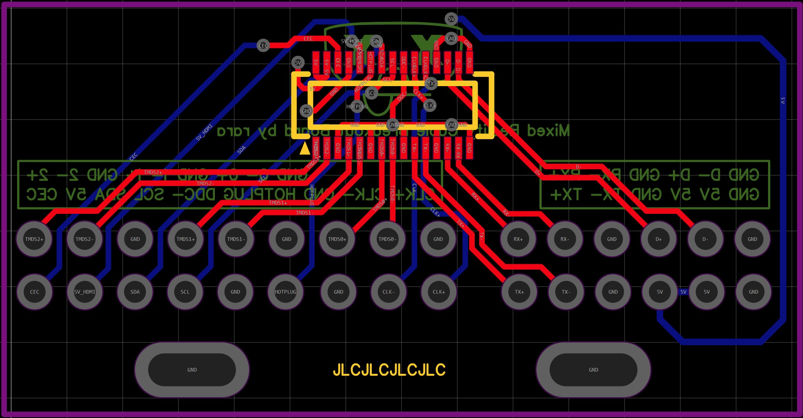

# USB-C mod for Windows Mixed Reality [WIP]
This project focuses on replacing the proprietary VR cable in Mixed Reality headsets with a single USB-C plug.

If you're here you probably know that the proprietary cables used in these headsets are prone to failure and unavailable for purchase as a separate part.
Due to damaged cables, dozens of Mixed Reality headsets sit in trash piles. I want to change that.

# Development log

###### Late 2022 - It's reverse engineering time!

I bought my headset in 2022 for about 12$ excluding shipping as spares or repair. That said it was in a terrible condition, missing both the front and back foams. Being a Medion ERAZER X1000 headset it didn't significantly differ from other designs and so it suffered the same fate as the other ones - a broken cable.
I found that the headset would work if the cable would be bent in a certain way but I couldn't pinpoint the exact place where the cable broke. This allowed me to confirm that indeed the headset was working but had a broken cable.

Thankfully, while the cable is not easily replaceable by the user from the outside it can be unplugged after disassembling the headset. It sits in a connector on the headset's mainboard and is screwed with two screws from the sides.

The first solution I came up with was to make a board that would replace the OEM cable with pads to solder the HDMI and USB cables to - and this was a terrible idea, but a fun project nonetheless.
I needed to reverse-engineer the original cable first, so I cut through the ends of the original cable to figure out the pinout for the connector that's on the headset's motherboard. This was a long process by itself, but below is the final pinout I ended up with.

So now that I had the pinout, I could start designing the PCB for the breakout board. Before that, I needed to know the part number for the plug-end of the connector.
It turns out it's a [MOLEX 555600307 connector](https://www.lcsc.com/product-detail/Mezzanine-Connectors-Board-to-Board_MOLEX-555600307_C505285.html) which is widely available and shouldn't be going anywhere in the near future - which is great! Knowing this I could finally make a breakout board for the headset.

This is how it came out. This is with inner ground layers disabled to better show my terrible PCB skills. This was my first PCB design ever so I went through many iterations before I ordered my PCB. Design files are available in this repository if you want to take a look.

When I received the boards I desoldered the connector from the original cable and soldered it onto one of my PCBs so that I didn't have to buy the MOLEX connectors yet.
Then I had to solder each wire from the HDMI and USB 3.0 cable to the breakout board which wasn't an easy task. I opted for very short HDMI/USB 3.0 cables so I could extend them later with an extender cable.

And that's where this idea went from good to terrible real quick. These cables do not like interference which means they are very sensitive and a lack of proper shielding can destroy data integrity.
D+ and D- kept interfering with USB 3.0 lines so I put them on a separate USB 2.0 cable. I also had to cut the shielding to make my PCB fit.

Upon putting the headset on my head I found another issue with this approach, the weight. OEM cables use one single cable with very thin wires inside that later split to separate connections for the PC. This allows them to significantly reduce the weight and the amount of strain on your head.
It's also an active cable which helps with the data integrity. This version however lacked this kind of features.

My solution didn't survive very long. Looking at it now, I'm surprised it even worked at all! After a few hours of playtime, my headset started struggling, and making it work for more than 5 minutes without having it crash completely was a struggle.
So I hit a wall and needed to find a different approach to fix my 12$ headset.

###### February 2024 - Never give up!

I recently became more interested in trying VR again. And so I went back to the drawing board and came up with an idea to make a USB-C mod for these headsets which would solve all of these issues. USB-C is just the way. 

The only downside I can think of at this point is that you will need a PC modern enough that it will feature a USB-C port with DP ALT mode.
You can also buy a PCI-Express expansion card with USB-C DP Alt mode like I plan to do later down the line.

Up next, I need to find an IC that will make it possible to transfer HDMI 2.0 and USB 3.0 over USB-C and design a new PCB around it.
